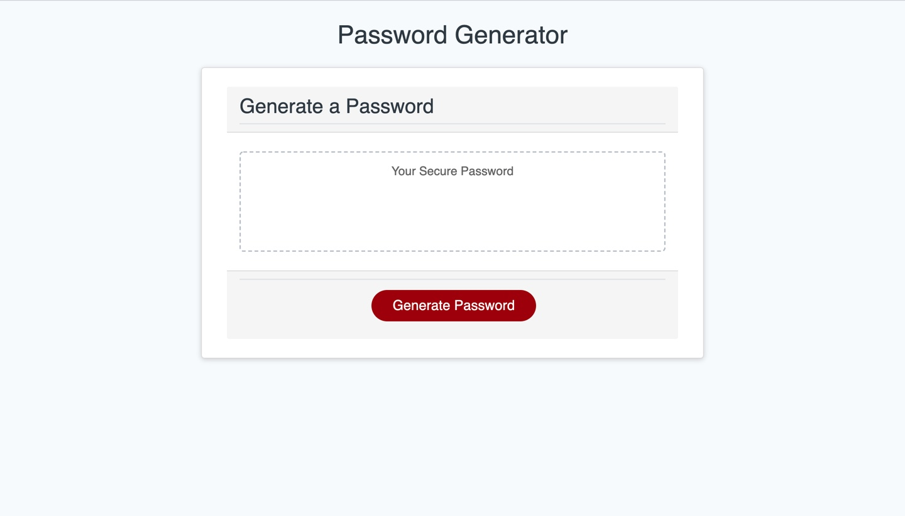

# Password-Generator-JavaScript

## Description
This web application was created so that employees could generate secure passwords utilizing customizeable criteria and randly selected characters.  The interface is simple in design, featuring a text content window and a button to generate the user's password.  Once the button is clicked, the user chooses the length of their password and the characters they would like included in it.  If the user chooses a length of less than 8 or more than 128, they receive an error message and start over the selection process.  If the user chooses 'cancel' for all character types, they will receive an error message and start over the prompts again.  After selections are made by the user, the password is displayed in the text content window. 

## Access
This application can be deployed in your web browser via the link below:

https://sleepytomatoes.github.io/Password-Generator-JavaScript/

## Resources
Building this project was very challenging, and required a deep dive into the layers and logic of Javascript.  I learned a lot about functions and troubleshooting using the console in devtools.  
During the process of building this application, I watched this tutorial on Youtube to get started:

https://www.youtube.com/watch?v=duNmhKgtcsI